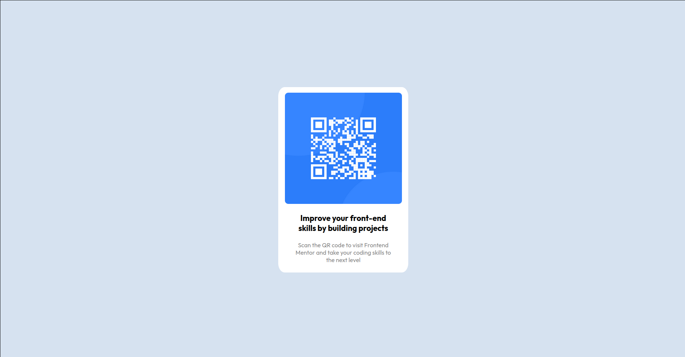

# Frontend Mentor - QR code component solution

This is a solution to the [QR code component challenge on Frontend Mentor](https://www.frontendmentor.io/challenges/qr-code-component-iux_sIO_H). Frontend Mentor challenges help you improve your coding skills by building realistic projects. 

## Table of contents

- [Frontend Mentor - QR code component solution](#frontend-mentor---qr-code-component-solution)
  - [Table of contents](#table-of-contents)
  - [Overview](#overview)
    - [Screenshot](#screenshot)
    - [Links](#links)
  - [My process](#my-process)
    - [Built with](#built-with)
    - [What I learned](#what-i-learned)
    - [Useful resources](#useful-resources)
  - [Author](#author)

## Overview
This project works with HTML5 and CSS3 to create a page with a QR Code in it, that way you learn how to use this tools to create a simple page.

### Screenshot



### Links

- Solution URL: [Solution](https://pedro-cella.github.io/qr-code-component/)

## My process
I divided the develpment into steps, wich are:

1- Changing the background color. This was a simple step, basically I just change the background-color of the body
2- Creating the white panel. This step I had some problems dealing with, because I couldn't understand how to position the rectangle exactly at the center of the page, so I first understand how to change the width and height and how this changes affect the background, then i searched to how to position something in the center, and found out that using some CSS I could do it without any problem. With that in mind I could move foward in the development of the page.
3- Adding QR Code image. Like the step before I had problems dealing with this one, specially because I was using an image, so I tried two paths, the first one I tried working with the image itself, but it was quite the challenge, because I couldn't see any change, and not only that but I was quite uncertain of how to position the image. So I started the second path, I worked with a new div, that way like I did on the step before, I changed width, height, color and found the perfect position, but when I change the background to the image, I have found a new problem, so in the end, I applied the CSS changes of the second path in the first path in other word, in the image itself, and add the margin changes so that could be exactly the same as in the design.
4- Adding first text. This one I had trouble because of the position, after many changes I finally found it, and with that finished I could focus on the style of the text.
5- Adding the second text. This one I knew what to do, much because of the fourth step, the challenge was in changing the transparency of the text, but it was quite easy with the rgba property in the CSS.

With this steps I could finish the project.
### Built with
- Semantic HTML5 markup
- CSS custom properties
### What I learned

I could learn more about position, specially the knowledge about when to use a div or not, other then that, I could understand more about using width and height,  properties that are actually used but I couldn't see how.

Some of my most important code parts are:

```html
  <div class="painel">
        
        <p class="catch-phrase">Improve your front-end<br> skills by building projects</p>
        <p class="sub-text">Scan the QR code to visit Frontend<br> Mentor and take your coding skills to<br> the next level</p>
    </div>
```

```css
div {
  width: 100px;
  height: 100px;
  
  position: absolute;
  top:0;
  bottom: 0;
  left: 0;
  right: 0;
  
  margin: auto;
}
```
### Useful resources

- [Best way to center a <div> on a page vertically and horizontally?](https://stackoverflow.com/questions/356809/best-way-to-center-a-div-on-a-page-vertically-and-horizontally) - This helped me centralize my div.

## Author

- Name - Pedro Vítor de Salles Cella
- Frontend Mentor - [@pedro-cella](https://www.frontendmentor.io/profile/pedro-cella)
- Github - [pedro-cella](https://github.com/pedro-cella)